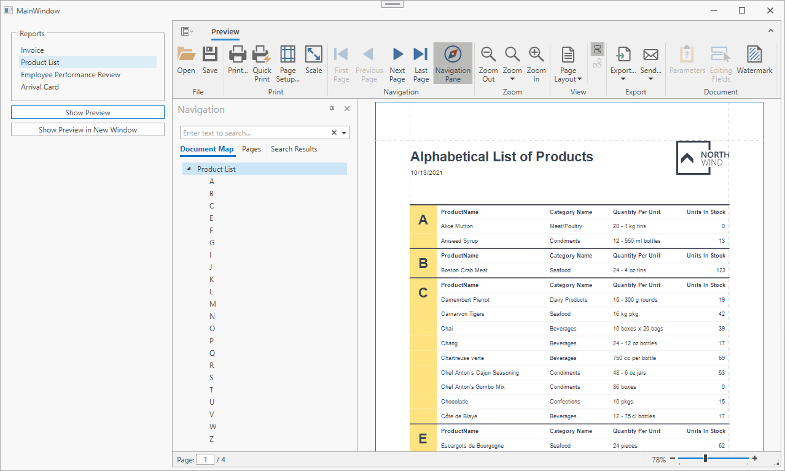

<!-- default badges list -->

<!-- default badges end -->
# How to Use the DocumentPreviewControl in a WPF MVVM Application to Preview a Report

This example demonstrates how to bind the [DocumentPreviewControl.DocumentSource](https://docs.devexpress.com/WPF/DevExpress.Xpf.DocumentViewer.DocumentViewerControl.DocumentSource property to the report source in the ViewModel. The project implements a command to show the report preview in a modal window. In this example the reports are stored in the SQLite database.

The ReportCatalogViewModel view model retrieves reports from a database and defines the following commands:
- `ShowReport`. Assigns a report instance to the view model property bound to the 
**DocumentViewerControl.DocumentSource** property.
- `ShowPreviewInNewWindow`. Creates the **DocumentPreviewDialogViewModel** view model instance that contains the current report. Uses the [DialogService](https://docs.devexpress.com/WPF/17467/mvvm-framework/services/predefined-set/dialog-services/dialogservice) to show the modal window with the report preview.

<!-- default file list -->
## Files to Look At

- [MainWindow.xaml](./CS/MainWindow.xaml) ([MainWindow.xaml](./VB/MainWindow.xaml))
- [ReportCatalogViewModel.cs](./CS/Models/ReportCatalogViewModel.cs) ([ReportCatalogViewModel.vb](./VB/Models/ReportCatalogViewModel.vb))
- [DocumentPreviewDialogViewModel.cs](./CS/Models/DocumentPreviewDialogViewModel.cs) ([DocumentPreviewDialogViewModel.vb](./VB/Models/DocumentPreviewDialogViewModel.vb))

<!-- default file list end -->

## Documentation

- [Document Preview API and Customization](https://docs.devexpress.com/XtraReports/119220/wpf-reporting/wpf-reporting-document-preview/api-and-customization)
- [Quick Guide to Print Preview Customization](https://docs.devexpress.com/XtraReports/119228/wpf-reporting/wpf-reporting-document-preview/api-and-customization/quick-guide-to-print-preview-customization)
- [DevExpress MVVM Framework](https://docs.devexpress.com/WPF/15112/mvvm-framework)

## More Examples

- [How to load the saved XtraReport document (*.prnx) in DocumentPreview](https://github.com/DevExpress-Examples/Reporting_how-to-load-the-saved-xtrareport-document-prnx-in-documentpreview-e4713)
<!-- feedback -->
## Does this example address your development requirements/objectives?

 

(you will be redirected to DevExpress.com to submit your response)
<!-- feedback end -->
